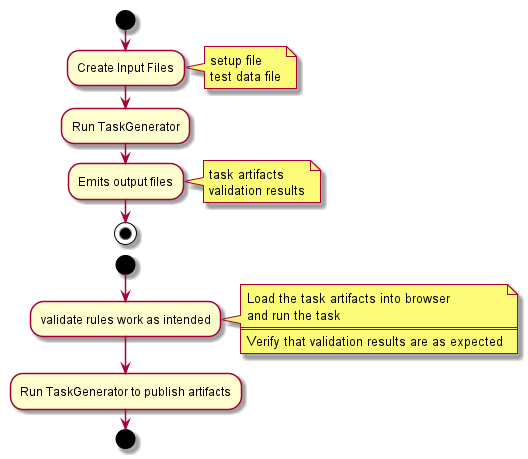

### Overview
TaskGenerator is used to define sequences and rules for use in experiments.  Once these sequences and rules have been
defined TaskGenerator can validate these rules and generate artifacts for use in running the experiment.

### Getting Started
Download the jar file.

### Usage
Ensure you have Java installed.  Create a setup file (refer to the `setup.props` file in the project)
Create a test data file (refer to the `testData.txt` file in the project).  Execute the following command:

`java -jar \path\to\jarfile \path\to\setup.props \path\to\testData.txt`

The results of the execution will either upload the JavaScript to S3 if AWS info is provided or output the generated 
Javascript to the console if not.  If any validation fails the failure will be reported on the console.

### Notes

  
 
